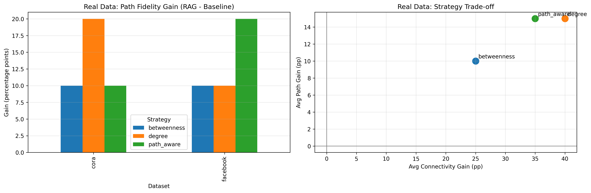
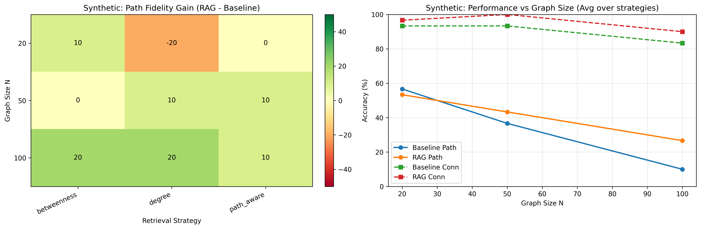

# Adaptive Graph-RAG: Mitigating Reasoning Collapse

Large Language Models are surprisingly bad at one thing you’d expect them to handle well: structured reasoning. When faced with graphs, they often get overwhelmed by noise and lose track of simple paths. This project explores how **retrieval over graphs (Graph-RAG)** can restore reasoning by focusing the model’s attention on the right substructure.

Instead of feeding the full graph into the model, we selectively retrieve a **query-relevant subgraph**, drastically reducing noise and improving both connectivity detection and shortest-path reasoning.


## Method Overview

This project implements an **Adaptive Graph-RAG framework** for structural reasoning tasks on graphs. The core idea is to mitigate *attention dilution* in LLMs by pruning irrelevant edges and nodes before inference.

Given a graph \( G = (V, E) \) and a query \((s, t)\), we:

1. Compute the shortest path \(P^*\)
2. Expand a candidate subgraph via k-hop BFS
3. Rank nodes using heuristic strategies:
   - **Path-aware** (distance-based)
   - **Degree-based** (hub prioritization)
   - **Betweenness centrality**
4. Construct a compact subgraph \(G' \subseteq G\)
5. Prompt the LLM with structured encoding (Incident Encoding)
6. Evaluate deterministically using Python (no LLM-as-judge)

All experiments were conducted using a local **LLaMA 3.1 (8B)** model via **Ollama**, ensuring reproducibility and controlled inference conditions.


## Results

### Real-World Graphs (Cora & Facebook)


**Figure 1.** Comparison of Graph-RAG and baseline performance on real-world datasets.

**Connectivity Accuracy**
- Baseline: ~43–47%
- Graph-RAG: **~90%**
- Improvement: **+43 to +47 percentage points**

**Path Fidelity**
- Baseline: ~6.7%
- Graph-RAG:
  - Cora: **20%**
  - Facebook: **46.7%**
- Improvement:
  - Cora: **~3×**
  - Facebook: **~7×**

**Strategy Insights**
- Degree-based retrieval: best path fidelity (~40–46%)
- Path-aware retrieval: best connectivity (~95%)
- Betweenness: balanced but less efficient


### Synthetic Graph Scaling


**Figure 2.** Effect of graph size on reasoning performance across synthetic graphs.

**Performance Trends**
- Baseline path accuracy drops from ~57% → ~10% as graph size increases
- Graph-RAG maintains higher performance: ~53% → ~27%
- Connectivity remains high:
  - Baseline: ~93% → ~83%
  - Graph-RAG: **~97% → ~90%**

### Key Insights

- As graph size increases, context noise dominates LLM attention, leading to a sharp drop in baseline path fidelity. Graph-RAG mitigates this effect, maintaining higher performance and more stable connectivity accuracy.

- Graph-RAG improves reasoning by pruning irrelevant edges and focusing the model on query-relevant topology, preventing attention dilution and reasoning collapse.

- Retrieval strategy matters: path-aware retrieval is strongest for connectivity detection, while degree-based retrieval is most effective for reconstructing valid shortest paths.

## Report

Full paper available here:

[Full Report (PDF)](docs/Report.pdf)


## Project Structure

```text
.
├── data/                          # Graph datasets: synthetic and real
├── docs/                          # Report and figures
│   ├── figures/
│   │   ├── real_evaluation_dashboard.png
│   │   └── synthetic_evaluation_dashboard.png
│   └── Report.pdf
├── output/                        # Experiment outputs
├── src/                           # Core implementation
├── graph_rag_evaluation.ipynb     # Main experimentation notebook
├── poetry.lock                    # Poetry lock file
├── pyproject.toml                 # Dependencies and project configuration
└── README.md
```


## Installation

This project uses Poetry.

```bash
poetry install
```

Activate the environment:

```bash
poetry shell
```


## Running Experiments

The main workflow is contained in:

```text
graph_rag_evaluation.ipynb
```

This notebook:

1. Generates synthetic graphs
2. Loads real datasets such as Cora and Facebook SNAP
3. Runs baseline versus Graph-RAG comparisons
4. Evaluates outputs deterministically with Python
5. Produces the final evaluation dashboards